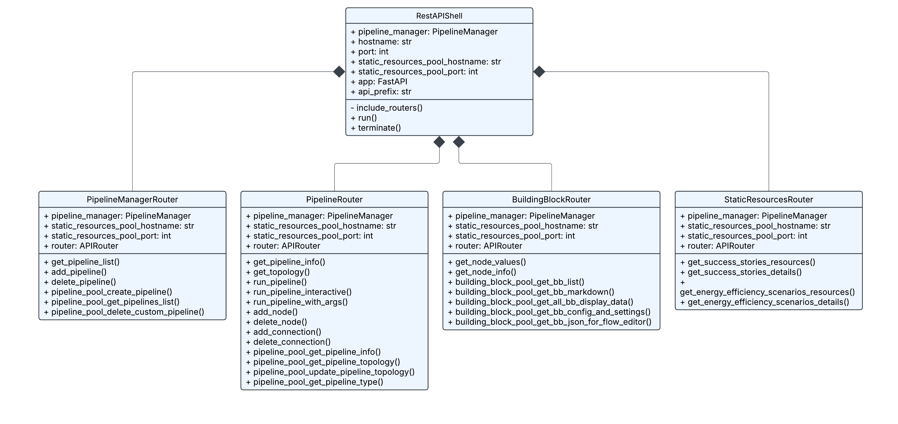
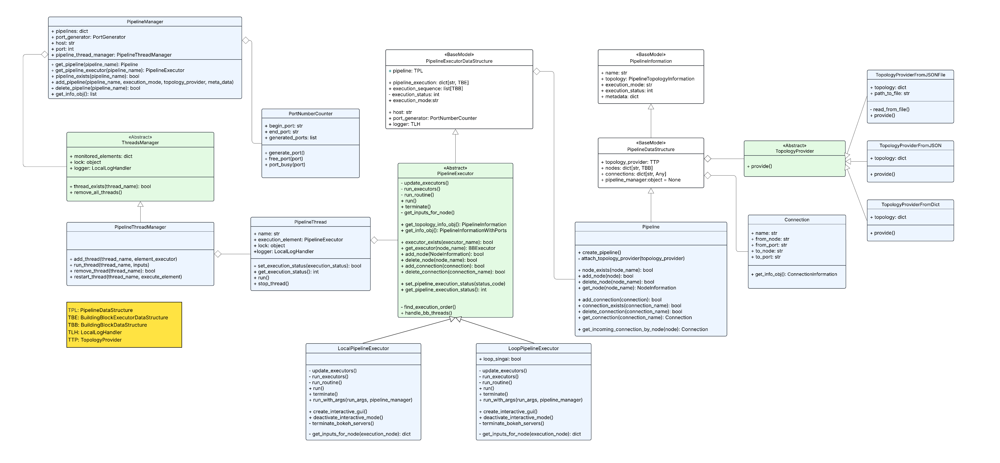
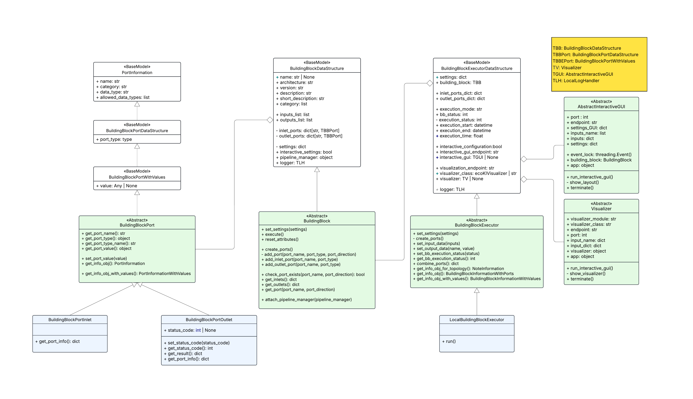
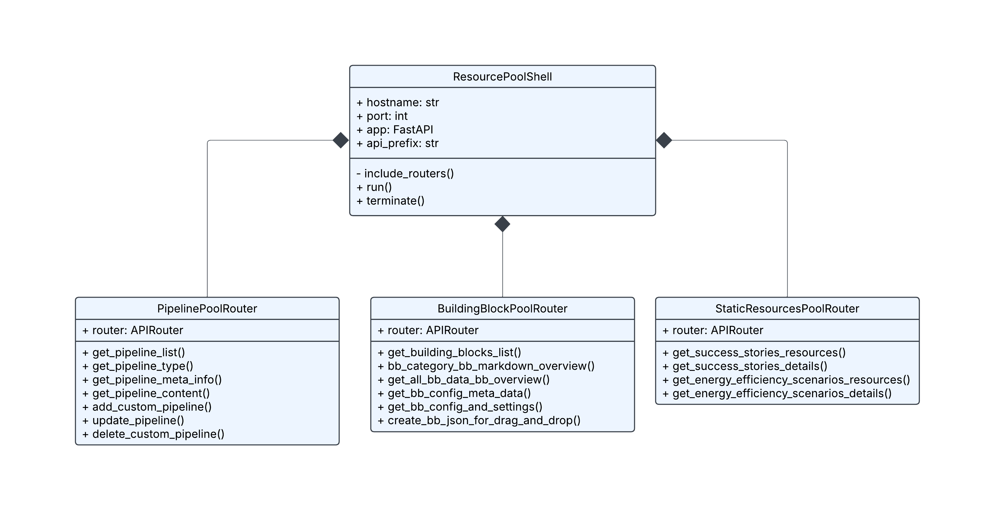

.. _ecoki_system_design:

================================================================================
EcoKI System Design: Architecting a Low-Code ML Platform for Industrial IoT
================================================================================

.. figure:: ecoki_architecture_files/Gemini_Generated_Ecoki_architecture.png
   :alt: EcoKI System Architecture - A comprehensive view of the layered microservices architecture
   :align: center
   :width: 100%
   :figclass: align-center

   **EcoKI System Architecture**: A layered microservices architecture designed for industrial machine learning applications. The system comprises five distinct layers: Frontend, Backend, Execution Engine, Resource Pool, and Data Acquisition & Storage.

How do you design a machine learning platform that can serve diverse industrial use cases, from energy optimization in factories to predictive maintenance in production lines, while remaining accessible to engineers without deep ML expertise? This was the central design challenge behind **EcoKI**, a low-code ML platform I helped architect and build.

This post offers a deep technical dive into the system design decisions that shaped EcoKI. We'll explore each architectural layer, examine the design patterns that enable modularity and scalability, and discuss the trade-offs inherent in building production-grade ML systems for industrial environments.

.. contents:: Table of Contents
   :local:
   :depth: 2

Architectural Philosophy: Design Principles
===========================================

Before diving into the specifics, it's essential to understand the core design principles that guided our architectural decisions.

**Separation of Concerns**

The architecture strictly separates concerns across five distinct layers:

1. **Presentation Layer** (Frontend) — User interaction and visualization
2. **API Gateway Layer** (Backend) — Request routing and orchestration
3. **Execution Layer** (Execution Engine) — Computation and ML pipeline processing
4. **Configuration Layer** (Resource Pool) — Static assets and metadata management
5. **Data Layer** (Data Acquisition & Storage) — Industrial data ingestion and persistence

This separation allows independent scaling, deployment, and maintenance of each component.

**Stateless Building Blocks**

Perhaps the most critical design decision was making all **Building Blocks stateless**. A Building Block is a self-contained unit of computation (e.g., data imputation, model training, feature selection) that:

- Takes inputs through well-defined ports
- Performs a single, atomic operation
- Produces outputs without retaining internal state between executions

.. note::

   **Why Statelessness?** Stateless components are inherently easier to test, parallelize, and scale horizontally. They eliminate race conditions and make debugging deterministic.

**Executor Pattern for Lifecycle Management**

Since Building Blocks are stateless, we introduced the **Executor Pattern** to manage their lifecycle. Executors handle:

- Resource allocation and cleanup
- Error handling and retry logic
- Logging and telemetry
- State persistence (externalized from the blocks themselves)

This separation of *what* to compute (Building Blocks) from *how* to execute (Executors) is a key enabler of the platform's flexibility.

Layer 1: Frontend — The Client Interface
=========================================

The frontend layer provides the user-facing interface through a browser-based dashboard built with modern web technologies.

**Component Architecture**

.. code-block:: text

    ┌─────────────────────────────────────────────────┐
    │              ecoKI Dashboard                    │
    │           (Browser Interface)                   │
    ├─────────────────────────────────────────────────┤
    │  ┌─────────────────┐  ┌─────────────────────┐  │
    │  │   Interactive    │  │     Pipeline        │  │
    │  │ Visualizations   │  │   Configurator      │  │
    │  │ (Charts/Graphs)  │  │  (Drag-and-drop)    │  │
    │  └─────────────────┘  └─────────────────────┘  │
    │  ┌─────────────────────────────────────────┐   │
    │  │           Control Panel                  │   │
    │  │            (Run/Stop)                    │   │
    │  └─────────────────────────────────────────┘   │
    └─────────────────────────────────────────────────┘
                         │
                         ▼
                  REST API (JSON)

The frontend comprises three primary components:

**1. Interactive Visualizations**

Real-time charts and graphs displaying:

- Live sensor data streams from industrial equipment
- Model predictions and confidence intervals
- Energy consumption metrics and optimization targets
- Historical trend analysis

**2. Pipeline Configurator**

A visual, drag-and-drop interface for constructing ML pipelines:

- Users connect Building Blocks as nodes in a directed acyclic graph (DAG)
- Visual validation of port compatibility (type checking at design time)
- Configuration panels for each block's hyperparameters
- Pipeline versioning and template management

**3. Control Panel**

Operational controls for pipeline execution:

- Start/Stop/Pause pipeline execution
- Real-time execution status and progress indicators
- Error notifications and diagnostic information

**Communication Protocol**

All frontend-backend communication uses RESTful APIs with JSON payloads. This decision was driven by:

- Universal browser support without plugins
- Easy debugging and inspection of requests
- Compatibility with standard monitoring tools

.. warning::

   **Design Constraint**: The frontend **never** communicates directly with the Resource Pool or Data Layer. All requests are proxied through the Backend's API shell. This ensures consistent authentication, authorization, and audit logging.

Layer 2: Backend — The API Gateway & Orchestration Layer
========================================================

The backend layer, implemented in **Python with FastAPI**, serves as the system's nerve center, handling all request routing, authentication, and pipeline orchestration.

   **Backend Layer Class Diagram**: The ``RestAPIShell`` serves as the main entry point, composing four specialized routers: ``PipelineManagerRouter`` for pipeline CRUD operations, ``PipelineRouter`` for execution control, ``BuildingBlockRouter`` for block metadata, and ``StaticResourcesRouter`` for static content delivery.

The UML diagram above reveals the core design pattern: **composition over inheritance**. The ``RestAPIShell`` aggregates multiple specialized routers, each responsible for a distinct API domain. This allows independent development and testing of each router while maintaining a unified API surface.

**FastAPI REST Interface**

.. code-block:: python

    # Simplified example of the API structure
    from fastapi import FastAPI, Depends, HTTPException
    from pydantic import BaseModel
    
    app = FastAPI(
        title="EcoKI Backend API",
        description="Low-code ML Platform API Gateway",
        version="1.0.0"
    )
    
    class PipelineConfig(BaseModel):
        """
        Pipeline configuration schema.
        Defines the DAG structure and block parameters.
        """
        pipeline_id: str
        blocks: list[BlockConfig]
        connections: list[Connection]
        metadata: dict
    
    @app.post("/api/v1/pipelines/execute")
    async def execute_pipeline(
        config: PipelineConfig,
        user: User = Depends(get_current_user)
    ):
        """
        Execute a pipeline with the given configuration.
        
        This endpoint:
        1. Validates the pipeline configuration
        2. Resolves block dependencies
        3. Delegates to PipelineThreadManager for execution
        4. Returns execution handle for status polling
        """
        # Validation and execution logic
        ...

The API layer acts as a **Gatekeeper**, performing:

- **Authentication & Authorization**: JWT-based token validation
- **Request Validation**: Pydantic schemas ensure type safety
- **Rate Limiting**: Protecting backend resources from abuse
- **Request Logging**: Audit trail for compliance

**Pipeline Manager: The Orchestration Core**

The ``PipelineManager`` sits at the top of the orchestration hierarchy, managing pipeline lifecycles and delegating execution to ``PipelineThreadManager``:

.. code-block:: python

    class PipelineManager:
        """
        Top-level manager for all pipeline operations.
        
        Attributes:
            pipelines: Dictionary of active pipeline instances
            port_generator: Allocates unique ports for inter-block communication
            pipeline_thread_manager: Handles concurrent pipeline execution
        """
        
        def __init__(self, host: str, port: int):
            self.pipelines: dict[str, Pipeline] = {}
            self.port_generator = PortGenerator()
            self.host = host
            self.port = port
            self.pipeline_thread_manager = PipelineThreadManager()
        
        def get_pipeline(self, pipeline_name: str) -> Pipeline:
            """Retrieve a pipeline by name."""
            return self.pipelines.get(pipeline_name)
        
        def get_pipeline_executor(self, pipeline_name: str) -> PipelineExecutor:
            """Get the executor associated with a pipeline."""
            ...
        
        def add_pipeline(
            self, 
            pipeline_name: str, 
            execution_mode: str,
            topology_provider: TopologyProvider,
            meta_data: dict
        ) -> bool:
            """
            Register a new pipeline with the manager.
            
            Args:
                pipeline_name: Unique identifier for the pipeline
                execution_mode: 'local' or 'loop' for streaming scenarios
                topology_provider: Strategy for loading pipeline definition
                meta_data: Additional pipeline metadata
            """
            ...

    class PipelineThreadManager(ThreadsManager):
        """
        Manages concurrent pipeline execution threads.
        
        Extends the abstract ThreadsManager to provide pipeline-specific
        thread lifecycle management.
        """
        
        def add_thread(
            self, 
            thread_name: str, 
            element_executor: PipelineExecutor
        ) -> None:
            """Register a new pipeline execution thread."""
            ...
        
        def run_thread(
            self, 
            thread_name: str, 
            inputs: dict
        ) -> None:
            """Start execution of a registered pipeline thread."""
            ...
        
        def remove_thread(self, thread_name: str) -> bool:
            """Stop and remove a pipeline thread."""
            ...
        
        def restart_thread(
            self, 
            thread_name: str, 
            execute_element: PipelineExecutor
        ) -> None:
            """Restart a pipeline thread with a new executor."""
            ...

**OpenAPI/Swagger Documentation**

FastAPI's automatic OpenAPI schema generation provides:

- Interactive API documentation at ``/docs``
- Client SDK generation for multiple languages
- Contract-first development workflow

Layer 3: Execution Engine — The Computational Core
==================================================

The Execution Engine is where the actual ML computation happens. It's designed around two key abstractions: **Pipelines** and **Executors**.

   **Pipeline & Executor Class Hierarchy**: This comprehensive diagram shows the relationships between ``PipelineManager``, ``PipelineThreadManager``, ``PipelineExecutor`` (with ``LocalPipelineExecutor`` and ``LoopPipelineExecutor`` implementations), ``Pipeline``, ``Connection``, and the ``TopologyProvider`` pattern for loading pipeline definitions from various sources.

The class diagram reveals several sophisticated design patterns working in concert:

- **Strategy Pattern**: ``TopologyProvider`` abstracts how pipeline topologies are loaded (JSON file, dict, etc.)
- **Template Method**: ``PipelineExecutor`` defines the execution skeleton, with concrete implementations providing specific behaviors
- **Thread Management**: ``PipelineThreadManager`` orchestrates ``PipelineThread`` instances for concurrent execution

**Pipeline as a Directed Acyclic Graph (DAG)**

A Pipeline is a sequence of connected Building Blocks forming a DAG:

.. code-block:: text

    ┌────────────┐     ┌────────────┐     ┌────────────┐
    │   Data     │────▶│   Pre-     │────▶│   Model    │
    │   Reader   │     │ processing │     │  Training  │
    └────────────┘     └────────────┘     └────────────┘
          │                                      │
          │           ┌────────────┐            │
          └──────────▶│  Feature   │────────────┘
                      │ Selection  │
                      └────────────┘

**DAG Properties Enforced**:

- **Acyclicity**: Prevents infinite loops in execution
- **Single Source/Sink**: Clear entry and exit points
- **Type Compatibility**: Output ports must match input port types

**Connection: The DAG Edges**

Connections represent the data flow between Building Blocks:

.. code-block:: python

    @dataclass
    class Connection:
        """
        Represents a directed edge in the pipeline DAG.
        
        Connects an outlet port of one block to an inlet port of another,
        defining how data flows through the pipeline.
        """
        name: str  # Unique identifier for this connection
        from_node: str  # Source block ID
        from_port: str  # Source outlet port name
        to_node: str  # Destination block ID
        to_port: str  # Destination inlet port name
        
        def get_info_obj(self) -> 'ConnectionInformation':
            """Return serializable connection metadata for the UI."""
            ...

    class Pipeline:
        """
        A directed acyclic graph of Building Blocks.
        
        Manages nodes (blocks), connections (edges), and topology validation.
        """
        
        def create_pipeline(self) -> None:
            """Initialize an empty pipeline."""
            ...
        
        def attach_topology_provider(
            self, 
            topology_provider: 'TopologyProvider'
        ) -> None:
            """Load pipeline structure from a topology provider."""
            ...
        
        def node_exists(self, node_name: str) -> bool:
            """Check if a block exists in the pipeline."""
            ...
        
        def add_node(self, node: 'BuildingBlock') -> bool:
            """Add a Building Block to the pipeline."""
            ...
        
        def delete_node(self, node_name: str) -> bool:
            """Remove a block and its connections."""
            ...
        
        def add_connection(self, connection: Connection) -> bool:
            """
            Add an edge between two blocks.
            
            Validates:
            - Both nodes exist
            - Ports exist on respective blocks
            - Port types are compatible
            - No cycles would be created
            """
            ...
        
        def get_incoming_connection_by_node(
            self, 
            node: str
        ) -> list[Connection]:
            """Get all connections feeding into a block."""
            ...

**TopologyProvider: Loading Pipeline Definitions**

The ``TopologyProvider`` pattern abstracts how pipeline structures are loaded:

.. code-block:: python

    class TopologyProvider(ABC):
        """
        Strategy interface for loading pipeline topologies.
        
        Different providers support different source formats,
        enabling flexibility in how pipelines are defined.
        """
        topology: dict
        
        @abstractmethod
        def provide(self) -> dict:
            """Load and return the pipeline topology."""
            pass

    class TopologyProviderFromJSONFile(TopologyProvider):
        """Load pipeline from a JSON file on disk."""
        
        def __init__(self, path_to_file: str):
            self.path_to_file = path_to_file
        
        def read_from_file(self) -> None:
            """Read JSON from the file system."""
            ...
        
        def provide(self) -> dict:
            """Return the parsed topology."""
            self.read_from_file()
            return self.topology

    class TopologyProviderFromDict(TopologyProvider):
        """Load pipeline from an in-memory dictionary."""
        
        def __init__(self, topology: dict):
            self.topology = topology
        
        def provide(self) -> dict:
            """Return the dictionary directly."""
            return self.topology

This pattern enables pipelines to be loaded from various sources: JSON files stored in the Resource Pool, configurations sent via API, or programmatically constructed in code.

**The Executor Pattern**

Executors provide a clean separation between computation logic and lifecycle management. The architecture employs a two-level executor hierarchy:

.. code-block:: python

    from abc import ABC, abstractmethod
    from dataclasses import dataclass
    from typing import Any
    
    
    @dataclass
    class PipelineExecutorDataStructure:
        """
        Holds execution state for a pipeline run.
        
        Separates mutable execution state from the executor logic,
        enabling state persistence and recovery.
        """
        pipeline: 'PipelineDataStructure'
        pipeline_execution: dict[str, 'BuildingBlockExecutorDataStructure']
        execution_sequence: list['BuildingBlockDataStructure']
        execution_status: int
        execution_mode: str
        host: str
        port_generator: 'PortNumberCounter'
        logger: 'LocalLogHandler'
    
    
    class PipelineExecutor(ABC):
        """
        Abstract base class for pipeline execution strategies.
        
        Defines the template for pipeline execution while allowing
        concrete implementations to vary execution behavior.
        """
        
        @abstractmethod
        def update_executors(self) -> None:
            """Refresh executor state before a run."""
            pass
        
        @abstractmethod
        def run_executors(self) -> None:
            """Execute all building blocks in sequence."""
            pass
        
        @abstractmethod
        def run(self) -> None:
            """Main execution entry point."""
            pass
        
        @abstractmethod
        def terminate(self) -> None:
            """Gracefully stop execution."""
            pass
        
        def _find_execution_order(self) -> list[str]:
            """
            Topological sort of the pipeline DAG.
            
            Returns block IDs in valid execution order.
            """
            ...
        
        def _handle_bb_threads(self) -> None:
            """Manage building block execution threads."""
            ...

    class LocalPipelineExecutor(PipelineExecutor):
        """
        Executes pipelines in a single-shot, batch mode.
        
        Use case: Training pipelines, batch inference, data preprocessing.
        Runs the pipeline once from start to finish.
        """
        
        def run(self) -> None:
            """Execute the pipeline once."""
            self.update_executors()
            self.run_executors()
        
        def run_with_args(
            self, 
            run_args: dict, 
            pipeline_manager: 'PipelineManager'
        ) -> None:
            """Execute with runtime arguments."""
            ...
        
        def create_interactive_gui(self) -> None:
            """Launch interactive visualization during execution."""
            ...

    class LoopPipelineExecutor(PipelineExecutor):
        """
        Executes pipelines in continuous streaming mode.
        
        Use case: Real-time monitoring, live sensor data processing,
        continuous prediction streams.
        
        The pipeline runs in a loop until explicitly stopped,
        processing new data as it arrives.
        """
        
        def __init__(self):
            self.loop_signal: bool = True  # Control flag for loop termination
        
        def run(self) -> None:
            """Execute the pipeline in a continuous loop."""
            while self.loop_signal:
                self.update_executors()
                self.run_executors()
                self.run_routine()  # Wait for new data or sleep interval
        
        def terminate(self) -> None:
            """Signal the loop to stop after current iteration."""
            self.loop_signal = False

**Building Block: The Atomic Unit**

   **Building Block Class Architecture**: The diagram illustrates the complete Building Block ecosystem: the ``Port`` system (``BuildingBlockPort``, ``BuildingBlockPortInlet``, ``BuildingBlockPortOutlet``), the core ``BuildingBlock`` abstraction with its data structures, the ``BuildingBlockExecutor`` for lifecycle management, and supporting classes like ``Visualizer`` and ``AbstractInteractiveGUI`` for interactive execution modes.

This class diagram reveals the depth of the Building Block abstraction:

- **Port System**: Type-safe inlet/outlet ports with ``PortInformation`` metadata enable compile-time validation of block connections
- **Separation of Data and Behavior**: ``BuildingBlockDataStructure`` holds serializable metadata, while ``BuildingBlock`` contains the execution logic
- **Executor Isolation**: ``BuildingBlockExecutor`` wraps execution with telemetry, error handling, and resource management
- **Interactive Mode**: ``AbstractInteractiveGUI`` and ``Visualizer`` support real-time visualization during development

Building Blocks are the fundamental computational units. The architecture carefully separates **metadata** (``BuildingBlockDataStructure``) from **behavior** (``BuildingBlock``):

.. code-block:: python

    from abc import ABC, abstractmethod
    from pydantic import BaseModel
    from typing import Any
    
    
    class PortInformation(BaseModel):
        """
        Metadata describing a port's contract.
        
        Used by the UI to render port connectors and validate connections.
        """
        name: str
        category: str  # e.g., 'data', 'model', 'config'
        data_type: str  # String representation for serialization
        allowed_data_types: list[str]  # Compatible types for connections
    
    
    class BuildingBlockDataStructure(BaseModel):
        """
        Serializable metadata for a Building Block.
        
        This structure is stored in the Resource Pool and used by the
        frontend to render blocks in the Pipeline Configurator.
        """
        name: str | None
        architecture: str  # e.g., 'preprocessing', 'model', 'visualization'
        version: str
        description: str
        short_description: str
        category: list[str]  # Tags for filtering in UI
        
        inputs_list: list[str]
        outputs_list: list[str]
        
        inlet_ports: dict[str, 'BuildingBlockPortDataStructure']
        outlet_ports: dict[str, 'BuildingBlockPortDataStructure']
        
        settings: dict  # Block-specific configuration schema
        interactive_settings: bool  # Whether block supports interactive mode
        pipeline_manager: object | None
        logger: 'LocalLogHandler'
    
    
    class BuildingBlockPort(ABC):
        """
        Abstract base class for typed ports.
        
        Ports are the connection points between blocks, enforcing
        type compatibility at both design-time and runtime.
        """
        
        @abstractmethod
        def get_port_name(self) -> str:
            """Return the port's identifier."""
            pass
        
        @abstractmethod
        def get_port_type(self) -> object:
            """Return the expected data type."""
            pass
        
        def set_port_value(self, value: Any) -> None:
            """Set the port's current value."""
            ...
        
        def get_info_obj(self) -> PortInformation:
            """Return serializable port metadata."""
            ...

    class BuildingBlockPortInlet(BuildingBlockPort):
        """Input port - receives data from upstream blocks."""
        
        def get_port_info(self) -> dict:
            """Return inlet-specific metadata."""
            ...

    class BuildingBlockPortOutlet(BuildingBlockPort):
        """
        Output port - sends data to downstream blocks.
        
        Includes status tracking for execution monitoring.
        """
        status_code: int | None = None
        
        def set_status_code(self, status_code: int) -> None:
            """Set execution status (0=success, non-zero=error)."""
            ...
        
        def get_result(self) -> dict:
            """Return the output value and status."""
            ...
    
    
    class BuildingBlock(ABC):
        """
        Abstract base class for all Building Blocks.
        
        Key Design Principles:
        - STATELESS: No internal state between execute() calls
        - SINGLE RESPONSIBILITY: One well-defined operation
        - TYPE-SAFE PORTS: Explicit input/output contracts via Ports
        
        Example implementations:
        - DataReader: Read from MongoDB, CSV, Parquet
        - DataImputer: Handle missing values
        - XGBoostRegressor: Train XGBoost model
        - ProcessParameterOptimizer: Black-box optimization
        """
        
        def set_settings(self, settings: dict) -> None:
            """Configure block parameters."""
            ...
        
        @abstractmethod
        def execute(self) -> None:
            """
            Execute the block's computation.
            
            Reads from inlet ports, performs computation,
            writes to outlet ports. MUST be stateless.
            """
            pass
        
        def create_ports(self) -> None:
            """Initialize inlet and outlet ports."""
            ...
        
        def add_inlet_port(self, port_name: str, port_type: type) -> None:
            """Register a new input port."""
            ...
        
        def add_outlet_port(self, port_name: str, port_type: type) -> None:
            """Register a new output port."""
            ...
        
        def get_inlets(self) -> dict[str, BuildingBlockPortInlet]:
            """Return all inlet ports."""
            ...
        
        def get_outlets(self) -> dict[str, BuildingBlockPortOutlet]:
            """Return all outlet ports."""
            ...
        
        def attach_pipeline_manager(self, pipeline_manager: 'PipelineManager') -> None:
            """Connect block to the pipeline manager for resource access."""
            ...

    class BuildingBlockExecutor(ABC):
        """
        Abstract executor for Building Block lifecycle management.
        
        Wraps block execution with telemetry, error handling,
        and resource management.
        """
        
        def set_settings(self, settings: dict) -> None:
            """Configure executor parameters."""
            ...
        
        def set_input_data(self, inputs: dict) -> None:
            """Populate inlet ports with input data."""
            ...
        
        def set_output_data(self, name: str, value: Any) -> None:
            """Write result to an outlet port."""
            ...
        
        def set_bb_execution_status(self, status: int) -> None:
            """Update execution status for monitoring."""
            ...
        
        def get_info_obj(self) -> 'BuildingBlockInformationWithPorts':
            """Return complete block information including port states."""
            ...

    class LocalBuildingBlockExecutor(BuildingBlockExecutor):
        """
        Concrete executor for local, in-process execution.
        
        Executes the building block in the current process,
        managing input/output data transfer through ports.
        """
        
        def run(self) -> None:
            """
            Execute the wrapped Building Block.
            
            1. Validate inputs are present on all required inlet ports
            2. Call block.execute()
            3. Capture outputs from outlet ports
            4. Record telemetry (duration, status)
            5. Handle any exceptions with proper error reporting
            """
            ...

**Interactive Visualization Support**

Building Blocks can optionally support interactive visualization during development and debugging:

.. code-block:: python

    class AbstractInteractiveGUI(ABC):
        """
        Base class for interactive Building Block interfaces.
        
        Enables real-time visualization of block execution,
        useful for debugging and development.
        """
        port: int
        endpoint: str
        settings_GUI: dict
        inputs_name: list
        inputs: dict
        settings: dict
        
        event_lock: threading.Event
        building_block: BuildingBlock
        app: object  # Panel/Bokeh application
        
        @abstractmethod
        def run_interactive_gui(self) -> None:
            """Launch the interactive interface."""
            pass
        
        def show_layout(self) -> None:
            """Render the visualization layout."""
            ...
        
        def terminate(self) -> None:
            """Shutdown the interactive interface."""
            ...

    class Visualizer(ABC):
        """
        Abstract base for data visualization components.
        
        Used by Building Blocks that produce visual outputs
        (charts, plots, dashboards).
        """
        visualizer_module: str
        visualizer_class: str
        endpoint: str
        port: int
        input_name: dict
        input_dict: dict
        visualizer: object
        app: object
        
        @abstractmethod
        def run_interactive_gui(self) -> None:
            """Start the visualization server."""
            pass
        
        def show_visualizer(self) -> None:
            """Display the visualization."""
            ...
        
        def terminate(self) -> None:
            """Shutdown the visualization server."""
            ...

.. tip::

   **Why this pattern?** The Building Block abstraction enables:
   
   - **Composability**: Blocks can be freely combined into pipelines via type-safe ports
   - **Testability**: Each block can be unit tested in isolation with mock port data
   - **Reusability**: Same block serves multiple use cases across different pipelines
   - **Discoverability**: ``BuildingBlockDataStructure`` provides rich metadata for UI rendering
   - **Debuggability**: Interactive GUI support allows real-time inspection during development

Layer 4: Resource Pool — Configuration & Static Assets
======================================================

The Resource Pool is a **standalone microservice** responsible for serving configuration files, metadata, and static content.

   **Resource Pool Service Architecture**: The ``ResourcePoolShell`` composes three specialized routers: ``PipelinePoolRouter`` for pipeline templates and metadata, ``BuildingBlockPoolRouter`` for block definitions and configurations, and ``StaticResourcesPoolRouter`` for success stories and energy efficiency scenarios.

The Resource Pool follows the same compositional pattern as the Backend layer, with ``ResourcePoolShell`` aggregating domain-specific routers. This architectural consistency simplifies understanding and maintenance across the codebase.

**Storage Containers**

The Resource Pool manages three types of artifacts:

**1. Config Files (JSON/YAML)**

Pipeline configurations, system settings, and deployment parameters:

.. code-block:: yaml

    # Example: settings.yaml
    pipeline:
      max_concurrent_blocks: 4
      timeout_seconds: 3600
      retry_policy:
        max_retries: 3
        backoff_multiplier: 2.0
    
    database:
      connection_string: "${MONGO_URI}"
      pool_size: 10
    
    logging:
      level: INFO
      format: "%(asctime)s - %(name)s - %(levelname)s - %(message)s"

**2. Metadata (Building Block Descriptions)**

Registry of available blocks with their documentation:

.. code-block:: json

    {
      "blocks": [
        {
          "id": "data_imputer_v1",
          "name": "DataImputer",
          "version": "1.0.0",
          "category": "preprocessing",
          "description": "Handle missing values with configurable strategies",
          "input_ports": [
            {"name": "data", "type": "DataFrame", "required": true}
          ],
          "output_ports": [
            {"name": "data", "type": "DataFrame"}
          ],
          "parameters": [
            {"name": "strategy", "type": "enum", "values": ["mean", "median", "mode"]}
          ]
        }
      ]
    }

**3. Static Content**

Non-code assets including:

- Success stories and case studies
- Energy efficiency scenario templates
- Documentation and help content

**Resource Pool API Structure**

The Resource Pool exposes its functionality through specialized routers:

.. code-block:: python

    class ResourcePoolShell:
        """
        Main entry point for the Resource Pool service.
        
        Composes domain-specific routers and manages the FastAPI application.
        """
        hostname: str
        port: int
        app: FastAPI
        api_prefix: str
        
        def include_routers(self) -> None:
            """Register all routers with the FastAPI app."""
            ...
        
        def run(self) -> None:
            """Start the Resource Pool server."""
            ...

    class PipelinePoolRouter:
        """Serves pipeline templates and metadata."""
        router: APIRouter
        
        def get_pipeline_list(self) -> list[str]:
            """List all available pipeline templates."""
            ...
        
        def get_pipeline_type(self, pipeline_id: str) -> str:
            """Get pipeline execution mode (local/loop)."""
            ...
        
        def get_pipeline_content(self, pipeline_id: str) -> dict:
            """Return full pipeline topology definition."""
            ...
        
        def add_custom_pipeline(self, pipeline: dict) -> bool:
            """Register a user-created pipeline template."""
            ...

    class BuildingBlockPoolRouter:
        """Serves Building Block definitions and documentation."""
        router: APIRouter
        
        def get_building_blocks_list(self) -> list[dict]:
            """List all available Building Blocks."""
            ...
        
        def get_bb_config_meta_data(self, block_id: str) -> dict:
            """Get block configuration schema."""
            ...
        
        def create_bb_json_for_drag_and_drop(self, block_id: str) -> dict:
            """Generate JSON for frontend drag-and-drop interface."""
            ...

    class StaticResourcesPoolRouter:
        """Serves static content and documentation."""
        router: APIRouter
        
        def get_success_stories_resources(self) -> list[dict]:
            """List available success story documents."""
            ...
        
        def get_energy_efficiency_scenarios_resources(self) -> list[dict]:
            """List energy optimization scenario templates."""
            ...

**Why a Standalone Service?**

Separating the Resource Pool as an independent service provides:

- **Independent Scaling**: Config serving can scale independently of computation
- **Caching**: Static content can be aggressively cached at the edge
- **Deployment Flexibility**: Config changes don't require backend redeployment
- **Version Management**: Configuration versioning separate from code

Layer 5: Data Acquisition & Storage — Industrial IoT Integration
================================================================

The bottom layer handles the challenging task of ingesting data from diverse industrial sources.

**Data Flow Architecture**

.. code-block:: text

    ┌───────────┐     ┌────────────────────┐     ┌──────────────┐
    │ Plant/    │────▶│ Plant Communication│────▶│   MongoDB    │
    │ Factory   │     │     Adapter        │     │ (On-Premise/ │
    │ Sensors   │     │ (Bridge/Ingestion) │     │ Off-Premise) │
    └───────────┘     └────────────────────┘     └──────────────┘
         │                     │                        │
         │              Normalized Data                 │
         │                     │                        │
    Raw Data              Protocol                  Flexible
    (Various              Translation               Schema
    Protocols)                                      Storage

**Plant Communication Adapter**

The adapter layer bridges the gap between industrial protocols and our platform:

.. code-block:: python

    class PlantCommunicationAdapter:
        """
        Bridge between industrial sensors and the EcoKI platform.
        
        Responsibilities:
        - Protocol translation (OPC-UA, MQTT, Modbus → internal format)
        - Data normalization and validation
        - Buffering for network resilience
        - Timestamp synchronization
        """
        
        def __init__(self, config: AdapterConfig):
            self.config = config
            self.buffer = CircularBuffer(max_size=config.buffer_size)
            self.normalizers = self._load_normalizers()
        
        def ingest(self, raw_data: bytes, protocol: str) -> NormalizedData:
            """
            Ingest raw sensor data and normalize for storage.
            
            Steps:
            1. Parse protocol-specific format
            2. Validate data integrity
            3. Normalize to standard schema
            4. Apply unit conversions
            5. Add metadata (source, timestamp, quality)
            """
            # Protocol-specific parsing
            parser = self._get_parser(protocol)
            parsed = parser.parse(raw_data)
            
            # Normalize to standard format
            normalized = self._normalize(parsed)
            
            # Buffer for batch writing
            self.buffer.append(normalized)
            
            return normalized

**Why MongoDB?**

The choice of MongoDB as the primary data store was driven by:

- **Schema Flexibility**: Industrial data varies wildly between plants
- **Time-Series Optimization**: Native support for time-series collections
- **Horizontal Scaling**: Sharding for high-volume sensor data
- **On-Premise Deployment**: Critical for data sovereignty requirements

.. code-block:: python

    # MongoDB time-series collection for sensor data
    db.create_collection(
        "sensor_readings",
        timeseries={
            "timeField": "timestamp",
            "metaField": "sensor_metadata",
            "granularity": "seconds"
        }
    )

**Dual Deployment Model**

The platform supports both on-premise and cloud deployment:

- **On-Premise**: For sensitive industrial data that cannot leave the factory
- **Off-Premise**: For aggregated analytics and cross-site comparisons

Cross-Cutting Concerns
======================

Several concerns span all layers and require dedicated attention.

**Containerization with Docker & Kubernetes**

Each layer is packaged as a Docker container for consistent deployment:

.. code-block:: dockerfile

    # Example Dockerfile for the Backend service
    FROM python:3.11-slim
    
    WORKDIR /app
    
    # Install Poetry for dependency management
    RUN pip install poetry
    
    # Copy dependency files
    COPY pyproject.toml poetry.lock ./
    
    # Install dependencies (no dev dependencies in production)
    RUN poetry config virtualenvs.create false \
        && poetry install --no-dev --no-interaction
    
    # Copy application code
    COPY src/ ./src/
    
    # Run with Uvicorn ASGI server
    CMD ["uvicorn", "src.main:app", "--host", "0.0.0.0", "--port", "8000"]

Kubernetes orchestrates the containers with:

- **Horizontal Pod Autoscaling**: Scale based on CPU/memory usage
- **Service Discovery**: Internal DNS for inter-service communication
- **ConfigMaps/Secrets**: Environment-specific configuration
- **Rolling Deployments**: Zero-downtime updates

**CI/CD Pipeline with GitLab**

The development workflow is fully automated:

.. code-block:: yaml

    # .gitlab-ci.yml
    stages:
      - lint
      - test
      - build
      - deploy
    
    lint:
      stage: lint
      script:
        - poetry run black --check src/
        - poetry run mypy src/
        - poetry run ruff src/
    
    test:
      stage: test
      script:
        - poetry run pytest tests/ --cov=src --cov-report=xml
      coverage: '/TOTAL.*\s+(\d+%)/'
    
    build:
      stage: build
      script:
        - docker build -t ecoki-backend:${CI_COMMIT_SHA} .
        - docker push registry/ecoki-backend:${CI_COMMIT_SHA}
    
    deploy:
      stage: deploy
      script:
        - kubectl set image deployment/backend backend=registry/ecoki-backend:${CI_COMMIT_SHA}
      only:
        - main

Design Trade-offs & Lessons Learned
===================================

Every architecture involves trade-offs. Here are the key decisions we made and their implications.

**Trade-off 1: Stateless Blocks vs. Execution Overhead**

*Decision*: All Building Blocks are stateless.

*Benefit*: Simplified testing, debugging, and horizontal scaling.

*Cost*: Additional overhead for state serialization between blocks. Large intermediate results (e.g., DataFrames) must be serialized and deserialized.

*Mitigation*: Implemented in-memory data passing within the same executor process, only serializing for cross-process or persistent storage.

**Trade-off 2: REST API vs. WebSocket for Real-Time Updates**

*Decision*: Primary communication via REST, with polling for status updates.

*Benefit*: Simpler implementation, better tooling support, stateless backend.

*Cost*: Higher latency for real-time updates, increased network traffic from polling.

*Future*: WebSocket upgrade planned for real-time streaming use cases.

**Trade-off 3: Monorepo vs. Polyrepo**

*Decision*: Single monorepo for all platform components.

*Benefit*: Atomic changes across layers, shared tooling, simplified CI/CD.

*Cost*: Larger repository size, potential for coupling between services.

*Mitigation*: Strict directory structure and code review policies enforce boundaries.

**Trade-off 4: Python Throughout vs. Polyglot Architecture**

*Decision*: Python for all components (frontend uses Python-based Panel library).

*Benefit*: Single language expertise required, easy ML library integration (scikit-learn, PyTorch, XGBoost).

*Cost*: Performance limitations for CPU-intensive frontend operations.

*Mitigation*: Critical paths optimized with Cython/Numba; frontend offloads computation to backend.

**Trade-off 5: Dual Execution Modes (Batch vs. Streaming)**

*Decision*: Support both ``LocalPipelineExecutor`` (batch) and ``LoopPipelineExecutor`` (streaming) modes.

*Benefit*: Flexibility to handle diverse industrial use cases:

- **Batch mode**: Training pipelines, historical data analysis, one-time preprocessing
- **Streaming mode**: Real-time sensor monitoring, live predictions, continuous optimization

*Cost*: Increased complexity in executor management; some blocks must be designed to handle both modes.

*Implementation*: The ``execution_mode`` parameter in ``PipelineManager.add_pipeline()`` determines which executor type is instantiated. The ``LoopPipelineExecutor.loop_signal`` flag enables graceful shutdown of streaming pipelines.

Conclusion
==========

The EcoKI architecture demonstrates how thoughtful system design can enable complex ML capabilities while maintaining accessibility for non-expert users. The key takeaways are:

1. **Layer Separation**: Clear boundaries between presentation, orchestration, execution, configuration, and data layers enable independent evolution and scaling.

2. **Stateless Computation with Typed Ports**: The Building Block pattern enforces statelessness while the Port system (``BuildingBlockPortInlet``, ``BuildingBlockPortOutlet``) ensures type-safe data flow between components.

3. **Executor Abstraction**: Separating *what* to compute (Building Blocks) from *how* to execute (Executors) enables both batch (``LocalPipelineExecutor``) and streaming (``LoopPipelineExecutor``) modes with the same block implementations.

4. **Strategy Patterns Throughout**: From ``TopologyProvider`` for loading pipeline definitions to the router composition pattern in both Backend and Resource Pool, the architecture favors composition and strategy patterns over inheritance.

5. **Industrial Pragmatism**: The architecture accommodates real-world constraints like on-premise deployment, diverse industrial protocols, data sovereignty requirements, and the need for interactive debugging during development.

Building a production ML platform is as much about software engineering as it is about machine learning. The abstractions you choose early—stateless blocks, typed ports, executor hierarchies—and the trade-offs you make consciously will determine your system's long-term viability and extensibility.

.. epigraph::

   Good architecture is not about predicting the future; it's about creating flexibility to adapt when the future arrives.
   
   -- *A lesson learned from EcoKI*

References & Further Reading
============================

.. [1] Kleppmann, M. (2017). *Designing Data-Intensive Applications*. O'Reilly Media.

.. [2] Newman, S. (2021). *Building Microservices*, 2nd Edition. O'Reilly Media.

.. [3] Fowler, M. (2002). *Patterns of Enterprise Application Architecture*. Addison-Wesley.

.. [4] FastAPI Documentation. https://fastapi.tiangolo.com/

.. [5] MongoDB Time Series Collections. https://www.mongodb.com/docs/manual/core/timeseries-collections/

.. [6] Kubernetes Documentation. https://kubernetes.io/docs/

.. [7] Sculley, D., et al. (2015). Hidden Technical Debt in Machine Learning Systems. *NeurIPS*.

