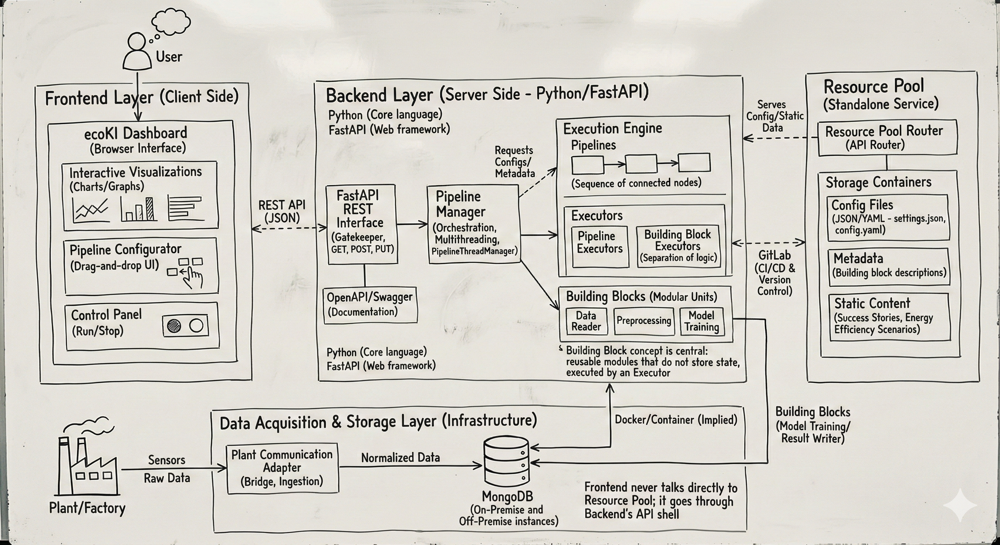

.. _ecoki_system_design_public:

================================================================================
Designing a Low-Code ML Platform: Lessons from Building EcoKI
================================================================================

   **EcoKI System Architecture**: A layered microservices architecture designed for industrial machine learning applications, comprising Frontend, Backend, Execution Engine, Resource Pool, and Data Acquisition layers.

How do you design a machine learning platform that serves diverse industrial use cases—from energy optimization in factories to predictive maintenance—while remaining accessible to engineers without deep ML expertise? 

This was the central challenge behind **EcoKI**, a low-code ML platform I helped architect. This post distills the key system design decisions, patterns, and trade-offs that shaped the platform.

.. contents:: Table of Contents
   :local:
   :depth: 2

The Core Design Challenge
=========================

Industrial ML platforms face a unique tension: they must be **powerful enough** to handle complex data pipelines and models, yet **simple enough** for domain experts (mechanical engineers, process engineers) to use without becoming ML specialists.

We identified three fundamental requirements:

1. **Composability**: Engineers should assemble ML workflows from pre-built components, like LEGO blocks
2. **Flexibility**: The platform must adapt to wildly different industrial contexts (steel mills, chemical plants, manufacturing lines)
3. **Operability**: Workflows must run reliably in production, with proper monitoring and error handling

These requirements drove every architectural decision that followed.

Architectural Principles
========================

Before diving into the layers, let's establish the principles that guided our design.

**Principle 1: Separation of Concerns**

The architecture strictly separates responsibilities across five layers:

.. list-table::
   :header-rows: 1
   :widths: 25 35 40

   * - Layer
     - Responsibility
     - Key Concern
   * - **Frontend**
     - User interaction
     - Usability, visualization
   * - **Backend**
     - API gateway & orchestration
     - Routing, authentication, coordination
   * - **Execution Engine**
     - ML computation
     - Performance, reliability
   * - **Resource Pool**
     - Configuration & metadata
     - Versioning, discoverability
   * - **Data Layer**
     - Industrial data ingestion
     - Protocol translation, storage

This separation enables independent scaling, deployment, and evolution of each component.

**Principle 2: Stateless Computation Units**

We made all computational units (which we called "Building Blocks") **stateless by design**. Each block:

- Receives inputs through well-defined interfaces
- Performs a single, atomic operation
- Produces outputs without retaining internal state

.. note::

   **Why Statelessness?** Stateless components are inherently easier to test, parallelize, and scale horizontally. They eliminate race conditions, make debugging deterministic, and enable seamless recovery from failures.

**Principle 3: Separate "What" from "How"**

We introduced an **Executor pattern** that separates the *logic* of what to compute from the *mechanics* of how to execute it. This abstraction handles:

- Resource allocation and cleanup
- Error handling and retry logic
- Logging and telemetry
- Execution mode (batch vs. streaming)

This separation proved invaluable when we needed to support both one-shot batch pipelines and continuous streaming workflows with the same building blocks.

The Five-Layer Architecture
===========================

Layer 1: Frontend — The Human Interface
---------------------------------------

The frontend provides a browser-based dashboard with three core capabilities:

**Visual Pipeline Builder**

A drag-and-drop interface where users construct ML workflows by connecting building blocks. The interface validates connections in real-time, ensuring type compatibility between components before execution.

**Interactive Visualizations**

Real-time charts displaying sensor data streams, model predictions, and energy metrics. Visualization was critical for our industrial users who needed to *see* what their models were doing.

**Execution Controls**

Simple start/stop controls with real-time status updates. Industrial users care about whether their pipeline is running correctly, not the internal mechanics.

.. important::

   **Design Decision**: The frontend never communicates directly with the data layer or resource pool. All requests flow through the backend's API gateway. This ensures consistent authentication, authorization, and audit logging across all operations.

Layer 2: Backend — The Orchestration Hub
----------------------------------------

The backend serves as the system's nerve center, built on Python with FastAPI. Its responsibilities include:

**API Gateway Functions**

- **Authentication**: Token-based validation for all requests
- **Request Validation**: Schema enforcement ensures malformed requests fail fast
- **Rate Limiting**: Protects backend resources from abuse
- **Audit Logging**: Compliance-ready request tracking

**Pipeline Orchestration**

The backend manages pipeline lifecycles through a dedicated orchestration component that:

- Parses pipeline configurations (directed acyclic graphs of building blocks)
- Determines execution order via topological sorting
- Manages concurrent execution threads
- Coordinates data flow between blocks

**Router Composition Pattern**

Rather than a monolithic API, we composed the backend from specialized routers:

- **Pipeline Management Router**: CRUD operations for pipeline definitions
- **Execution Router**: Start, stop, and monitor pipeline runs  
- **Building Block Router**: Metadata and configuration for available components
- **Static Resources Router**: Documentation and help content

This composition allowed teams to develop and test routers independently while maintaining a unified API surface.

Layer 3: Execution Engine — Where ML Happens
--------------------------------------------

The Execution Engine is the computational core, designed around two key abstractions.

**Pipelines as Directed Acyclic Graphs**

A pipeline is a graph where:

- **Nodes** are building blocks (data readers, preprocessors, models, visualizers)
- **Edges** are typed connections defining data flow

The DAG structure enforces important constraints:

- **Acyclicity**: No infinite loops in execution
- **Type Safety**: Output types must match input types at connection points
- **Deterministic Ordering**: Topological sort ensures correct execution sequence

**The Executor Hierarchy**

We implemented two execution modes through an executor abstraction:

.. list-table::
   :header-rows: 1
   :widths: 30 70

   * - Executor Type
     - Use Case
   * - **Batch Executor**
     - Training pipelines, historical analysis, one-time preprocessing. Runs the pipeline once from start to finish.
   * - **Streaming Executor**
     - Real-time monitoring, live predictions, continuous optimization. Runs in a loop, processing new data as it arrives.

The same building blocks work in both modes—only the executor changes. This flexibility proved essential for industrial clients who needed both offline model training and real-time inference.

**Building Blocks: The Atomic Units**

Each building block encapsulates a single operation:

- **Data Readers**: MongoDB, CSV, Parquet, industrial protocols
- **Preprocessors**: Imputation, normalization, feature engineering
- **Models**: XGBoost, Linear Regression, LSTM networks
- **Optimizers**: Black-box optimization for process parameters
- **Visualizers**: Real-time dashboards and charts

Blocks communicate through **typed ports**—explicit input and output interfaces that enable:

- **Design-time validation**: The UI can verify connections before execution
- **Runtime type checking**: Mismatched data fails fast with clear errors
- **Self-documentation**: Ports describe what a block expects and produces

Layer 4: Resource Pool — The Configuration Service
--------------------------------------------------

The Resource Pool is a standalone microservice managing three types of artifacts:

**Pipeline Templates**

Pre-configured pipeline definitions that users can instantiate and customize. Templates accelerate onboarding by providing working examples for common use cases.

**Building Block Registry**

Metadata about available blocks: descriptions, configuration schemas, port definitions. This registry powers the frontend's block palette and configuration panels.

**Static Content**

Documentation, success stories, and energy efficiency scenario templates. Keeping this content in a dedicated service simplifies updates without backend redeployment.

.. tip::

   **Why Standalone?** Separating the Resource Pool provides independent scaling, aggressive caching for static content, and configuration versioning decoupled from code releases.

Layer 5: Data Acquisition — Industrial Integration
--------------------------------------------------

The bottom layer tackles the messy reality of industrial data.

**Protocol Translation**

Industrial equipment speaks many languages: OPC-UA, MQTT, Modbus, proprietary protocols. Our adapter layer translates these into a normalized internal format, shielding upper layers from protocol complexity.

**Data Characteristics**

Industrial sensor data has unique characteristics:

- **High Volume**: Thousands of sensors sampling at sub-second intervals
- **Variable Quality**: Missing values, sensor drift, outliers
- **Schema Diversity**: Every plant has different sensor configurations

We chose MongoDB for its schema flexibility and native time-series support, with deployment options for both on-premise (data sovereignty) and cloud (aggregated analytics).

Design Patterns That Worked
===========================

Several patterns proved particularly valuable across the architecture.

**Strategy Pattern for Flexibility**

We used the Strategy pattern extensively:

- **Topology Providers**: Load pipeline definitions from JSON files, databases, or in-memory dictionaries
- **Execution Strategies**: Batch vs. streaming execution with the same interface
- **Data Adapters**: Protocol-specific parsing behind a common interface

This pattern enabled us to add new capabilities without modifying existing code.

**Composition Over Inheritance**

Both the Backend and Resource Pool use router composition rather than deep inheritance hierarchies. Each router handles a specific domain, composed into the main application at startup. Benefits:

- Routers can be developed and tested independently
- Easy to add new functionality without touching existing routers
- Clear ownership boundaries for teams

**Data Structure Separation**

For key entities (pipelines, building blocks), we separated:

- **Data Structures**: Serializable metadata for storage and transmission
- **Behavior Classes**: Execution logic and methods

This separation simplified serialization, enabled richer metadata for the UI, and made the codebase more testable.

Trade-offs We Made
==================

Every architecture involves trade-offs. Here are the key decisions and their implications.

**Trade-off 1: Statelessness vs. Performance**

*Decision*: All building blocks are stateless.

*Benefit*: Simplified testing, debugging, and horizontal scaling. No race conditions.

*Cost*: Additional overhead for passing data between blocks. Large DataFrames must be serialized at process boundaries.

*Mitigation*: In-memory data passing within the same executor process; serialization only for persistence or cross-process communication.

**Trade-off 2: REST vs. WebSocket**

*Decision*: REST API with polling for status updates.

*Benefit*: Simpler implementation, excellent tooling support, stateless backend.

*Cost*: Higher latency for real-time updates, increased network traffic from polling.

*Future Direction*: WebSocket upgrade planned for streaming scenarios requiring sub-second updates.

**Trade-off 3: Python Throughout**

*Decision*: Python for all components, including frontend (Panel library).

*Benefit*: Single language expertise, seamless ML library integration (scikit-learn, PyTorch, XGBoost), faster development.

*Cost*: Performance limitations for CPU-intensive operations.

*Mitigation*: Critical paths optimized with Cython/Numba; frontend delegates heavy computation to backend.

**Trade-off 4: Batch + Streaming Support**

*Decision*: Support both execution modes with the same building blocks.

*Benefit*: Flexibility for diverse use cases; users can prototype in batch mode then deploy as streaming.

*Cost*: Increased complexity in executor management; some blocks require careful design to work in both modes.

*Implementation*: Execution mode is a pipeline-level configuration, transparent to individual building blocks.

**Trade-off 5: Monorepo Structure**

*Decision*: Single repository for all platform components.

*Benefit*: Atomic changes across layers, shared tooling, simplified CI/CD.

*Cost*: Larger repository, potential for coupling.

*Mitigation*: Strict directory structure and code review policies enforce layer boundaries.

Lessons Learned
===============

After building and operating EcoKI, several lessons stand out:

**1. Invest in Abstractions Early**

The Building Block and Executor patterns required significant upfront investment, but paid dividends throughout development. Good abstractions make the system predictable and extensible.

**2. Design for the User's Mental Model**

Industrial engineers think in terms of data flows and transformations, not code. The visual pipeline builder aligned with their mental model, dramatically reducing the learning curve.

**3. Embrace Constraints**

Industrial requirements (on-premise deployment, data sovereignty, diverse protocols) initially felt like constraints. They turned out to be clarifying forces that drove better architectural decisions.

**4. Separate What Changes from What Doesn't**

Configuration and metadata (Resource Pool) change frequently. Execution logic (Building Blocks) changes less often. Code infrastructure (Backend/Execution Engine) changes rarely. Separating these enabled appropriate update cadences for each.

**5. Make Debugging Observable**

We added interactive visualization modes for building blocks, allowing engineers to inspect intermediate data during development. This investment in debuggability accelerated problem resolution dramatically.

Conclusion
==========

The EcoKI architecture demonstrates how thoughtful system design can enable complex ML capabilities while maintaining accessibility for non-expert users. The key takeaways:

1. **Layer Separation** enables independent evolution and scaling of components
2. **Stateless Computation** simplifies testing, debugging, and horizontal scaling
3. **Executor Abstraction** supports multiple execution modes with shared components
4. **Strategy Patterns** provide flexibility without code modification
5. **Industrial Pragmatism** accommodates real-world constraints like on-premise deployment and protocol diversity

Building a production ML platform is as much about software engineering as it is about machine learning. The abstractions you choose early, the patterns you establish, and the trade-offs you make consciously will determine your system's long-term viability.

.. epigraph::

   Good architecture is not about predicting the future; it's about creating flexibility to adapt when the future arrives.
   
   -- *A lesson learned from EcoKI*

Further Reading
===============

For those interested in diving deeper into the concepts discussed:

- Kleppmann, M. (2017). *Designing Data-Intensive Applications*. O'Reilly Media.
- Newman, S. (2021). *Building Microservices*, 2nd Edition. O'Reilly Media.
- Fowler, M. (2002). *Patterns of Enterprise Application Architecture*. Addison-Wesley.
- Sculley, D., et al. (2015). Hidden Technical Debt in Machine Learning Systems. *NeurIPS*.

