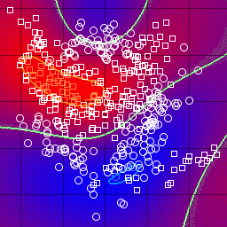

.. _Master_Thesis:

========================
Master's Thesis Research
========================

My Master's thesis focused on tackling the computational complexity of kernelized Support Vector Machines (SVMs) for large-scale, binary classification problems. I developed a new algorithm that improved upon the industry-standard methods by combining two powerful optimization techniques to achieve faster convergence and a more compact model.

   **Visualization of Support Vector Machine classification boundary and support vectors**

*******************************************************
The Challenge: Large-Scale Kernelized SVMs
*******************************************************

The central problem was the "curse of kernelization" in Support Vector Machines (SVMs). For large datasets with millions of data points, the number of "support vectors" required to define the model grows linearly with the dataset size. This leads to a significant increase in:

* **Computational Time:** The time required for training and prediction becomes prohibitive.
* **Memory Footprint:** The model's memory requirements become too large for modern computers.

The goal was to create a new, computationally efficient algorithm that could outperform the industry-standard libraries like LIBSVM while maintaining high accuracy.

*******************************************************
Foundational Concepts and Algorithms
*******************************************************

My solution was built by combining two key algorithmic approaches to address the dual challenges of optimization speed and model complexity.

**2.1 Adaptive Coordinate Frequencies (ACF) - Coordinate Descent (CD)**

* **Concept:** The Coordinate Descent (CD) algorithm is an iterative optimization method that works on one coordinate (or dual variable) at a time. This is highly efficient when partial derivatives are faster to compute than the full gradient.
* **Innovation:** The **Adaptive Coordinate Frequencies (ACF)** method enhances this by giving "preferences" (or probabilities) to each coordinate based on the progress it makes. These preferences are updated online, allowing the algorithm to intelligently select the most impactful coordinates for faster convergence.

**2.2 Budgeted Dual Coordinate Ascent (BDCA)**

* **Concept:** This approach solves the dual SVM problem with a **budget constraint**, effectively limiting the total number of support vectors used to represent the model to a fixed value, B.
* **Innovation:** A key component is the "merging strategy," which combines the influence of multiple support vectors into a single one to maintain the budget. This reduces model complexity from O(n) to a fixed O(B), but it also makes the optimization problem non-convex.

*******************************************************
The Novel ACF-BDCA Algorithm
*******************************************************

The core contribution of my thesis was the development of the **Adaptive Coordinate Frequency-Budgeted Dual Coordinate Ascent (ACF-BDCA)** algorithm. This new method successfully combined the superior, adaptive coordinate selection of the ACF method with the memory and speed benefits of the Budgeted Dual Coordinate Ascent (BDCA) approach.

**Key Contributions of the Algorithm:**

* **Faster Convergence:** The algorithm intelligently selects coordinates to focus on, leading to a much faster training time.
* **Smoother Performance:** It showed smoother initial convergence with less fluctuation in accuracy compared to the baseline BDCA method.
* **Significant Speedup:** Through extensive experiments on large-scale datasets, ACF-BDCA consistently demonstrated a speedup of over 30% compared to the baseline.

*******************************************************
A New Stopping Criterion
*******************************************************

**The Challenge:** The budget maintenance strategy makes the optimization problem non-convex, meaning it does not converge to a single, easily identifiable optimum. Standard stopping criteria that rely on gradients converging to zero are therefore no longer effective.

**My Solution:** I conducted an extensive exploratory analysis of various parameters, such as gradients and objective function values. I discovered a new, robust stopping criterion based on the behavior of the maximum and minimum pseudo-gradient values. By monitoring the logarithmic gap between these values, I was able to confidently halt the optimization process.

**The Outcome:** This novel criterion enabled the algorithm to achieve high performance while avoiding unnecessary computation, allowing for a quantifiable and reliable measure of convergence in a non-convex setting.

*******************************************************
Implementation and Transferable Skills
*******************************************************

The algorithm was implemented from scratch in C++, demonstrating my ability to build a generic, high-performance library from the ground up without relying on external machine learning libraries. This challenging process honed my skills in:

* **C++ Programming:** I gained deep expertise in building robust, performant code.
* **Advanced Optimization:** I worked with enhanced gradient-based methods, which are fundamental to modern machine learning.
* **Debugging Complex Systems:** I developed systematic strategies for debugging unpredictable and fluctuating parameters in non-convex optimization problems.

*******************************************************
Thesis Abstract and Download
*******************************************************

**Title:** Applying Budget Maintenance strategy on the Adaptive Coordinate Frequency-Coordinate Descent
**Supervisors:** Prof. Dr. Markus König & Prof. Dr. Tobias Glasmachers

**Abstract:**

Support Vector Machines (SVMs) are popular machine learning methods, especially for binary classification of data. Computational complexity of kernelized (Non-linear) SVMs becomes a limiting factor when dealing with large-scale machine learning problems. This thesis presents an online adaptive version of Dual coordinate ascent that honours a budget constraint and restricts the number of support vectors used to represent the model. This new algorithm is coined as Adaptive coordinate frequency-budgeted stochastic coordinate descent (ACF-BDCA). The Budget methods have proven to be effective for reducing the training time of kernel SVM while retaining high accuracy. In addition to that, instead of fixing selection frequencies of a general Coordinate ascent with uniform random selection of coordinates, the Adaptive coordinate frequencies (ACF) method removes the need to estimate optimal coordinate frequencies beforehand, and it automatically reacts to changing requirements during an optimization run. The ACF-BDCA algorithm has demonstrated the ability to significantly speed-up the BDCA method. Also, a new robust stopping criterion was successfully designed to halt this non-convex optimization problem, while achieving good performance levels.

**Download full thesis:** `Abhijeet_Pendyala_Master_Thesis.pdf <https://github.com/Pendu/Portfolio/blob/06d606a7d9821bce407e546517501a92042c7e3a/source/CV_aug_2025.pdf>`_
